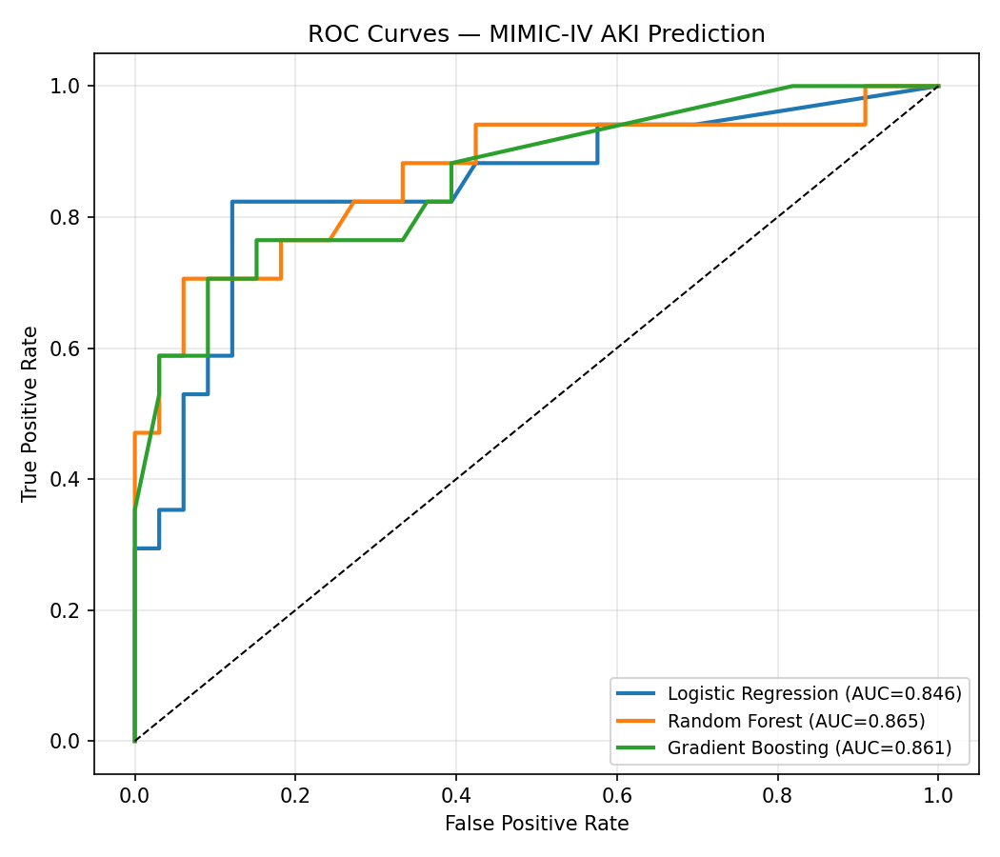
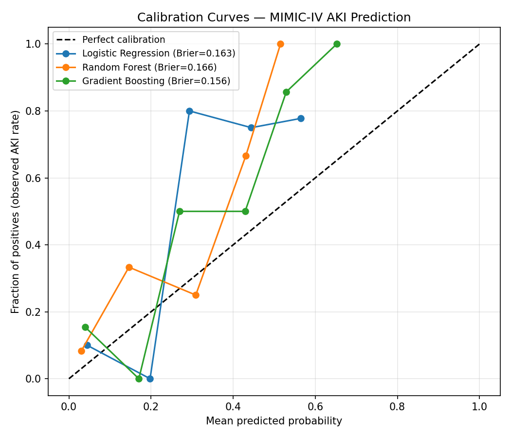
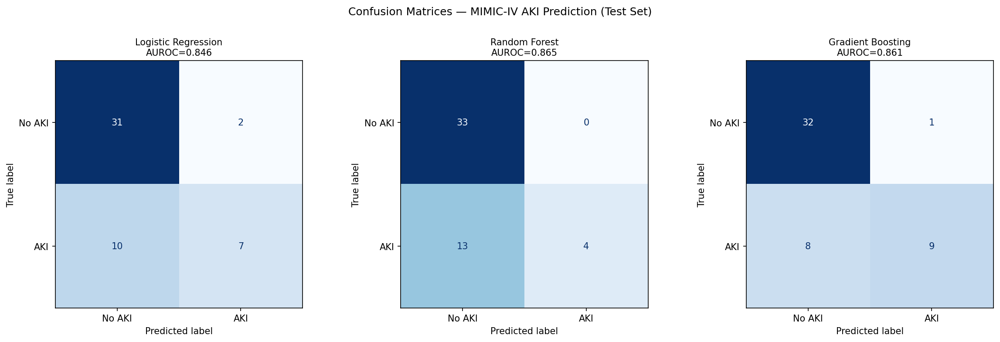
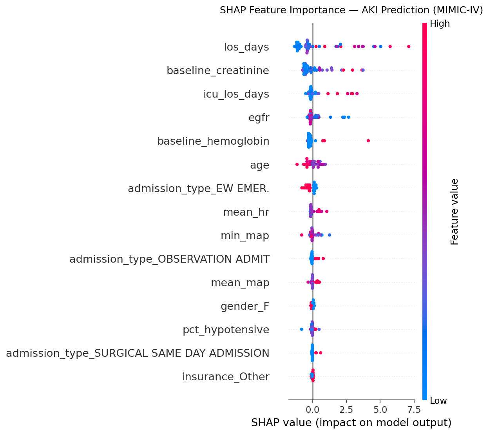

# RAISE-AKI — Postoperative AKI Prediction

A clean, reproducible ML pipeline for predicting **Acute Kidney Injury (AKI)** from clinical data, built as a prototype for the RAISE-AKI project and validated on the publicly available **MIMIC-IV Demo** dataset.

---

## Objective

Predict AKI occurrence (binary label, KDIGO criteria) in hospital admissions using pre-admission and intraoperative features extracted via SQL from an EHR-structured database.

---

## Project Structure

```
raise_aki/
├── src/
│   ├── data.py       # SQL cohort extraction from MIMIC-IV tables
│   ├── features.py   # Feature engineering + sklearn preprocessing pipeline
│   ├── models.py     # Model training, calibration, evaluation, and plots
│   └── explain.py    # SHAP-based global and local interpretability
├── notebooks/
│   └── AKI_Prediction_MIMIC.ipynb   # End-to-end pipeline notebook
├── data/
│   └── mimic_iv_demo/               # MIMIC-IV Demo CSV files (hosp/ + icu/)
└── results/                         # Generated outputs (plots, CSVs)
```

---

## Dataset

**MIMIC-IV Demo** (Johnson et al., PhysioNet 2023) — 100 de-identified patients from Beth Israel Deaconess Medical Center.

- Freely available: https://physionet.org/content/mimic-iv-demo/
- Tables used: `patients`, `admissions`, `labevents`, `icustays`, `chartevents`

**AKI label** derived from creatinine per KDIGO 2012 criteria:
- Peak creatinine ≥ 1.5× baseline, **or**
- Peak creatinine rise ≥ 0.3 mg/dL

---

## Features

| Feature | Source | Description |
|---|---|---|
| `age` | patients | Patient age at admission |
| `gender` | patients | Sex (M/F) |
| `admission_type` | admissions | Emergency / Elective / ... |
| `los_days` | admissions | Hospital length of stay |
| `baseline_creatinine` | labevents | First creatinine on admission |
| `baseline_hemoglobin` | labevents | First hemoglobin on admission |
| `egfr` | derived | eGFR from MDRD equation |
| `ckd_flag` | derived | eGFR < 60 → CKD flag |
| `mean_map` | chartevents (ICU) | Mean arterial pressure (mmHg) |
| `min_map` | chartevents (ICU) | Minimum MAP |
| `pct_hypotensive` | chartevents (ICU) | % time with MAP < 65 mmHg |
| `mean_hr` | chartevents (ICU) | Mean heart rate |
| `n_icu_stays` | icustays | Number of ICU stays |
| `icu_los_days` | icustays | Total ICU length of stay |
| `has_icu_data` | derived | Binary flag: ICU admission |

---

## Results

> Test set: 50 admissions (20% held-out, ordered split)  
> AKI prevalence in test set: 34% (17/50)

### ROC Curves



### Calibration Curves

Reliability diagrams show how well predicted probabilities match observed AKI rates.  
Points close to the diagonal = well-calibrated model.



### Confusion Matrices



### Full Metrics (Test Set)

| Model | AUROC | Brier ↓ | Sensitivity | Specificity | PPV | NPV |
|---|---|---|---|---|---|---|
| **Gradient Boosting** | 0.861 | **0.156** | **52.9%** | 97.0% | **90.0%** | **80.0%** |
| Random Forest | **0.865** | 0.166 | 23.5% | **100%** | **100%** | 71.7% |
| Logistic Regression | 0.846 | 0.163 | 41.2% | 93.9% | 77.8% | 75.6% |

> **Reading the trade-offs:**  
> - **Random Forest** achieves the highest AUROC and perfect PPV (zero false alarms) but misses many AKI cases (low sensitivity).  
> - **Gradient Boosting** offers the best overall balance — best Brier score, reasonable sensitivity, and only 1 false alarm.  
> - **Logistic Regression** is the most interpretable and competitive despite its simplicity.

All models are **isotonic-calibrated** (Niculescu-Mizil & Caruana, ICML 2005) using 5-fold cross-validated calibration to ensure predicted probabilities are reliable.

### SHAP Feature Importance (Gradient Boosting)



| Rank | Feature | Mean \|SHAP\| | Interpretation |
|---|---|---|---|
| 1 | `los_days` | 1.51 | Longer stays associated with higher AKI risk |
| 2 | `baseline_creatinine` | 0.73 | Pre-existing kidney function |
| 3 | `icu_los_days` | 0.43 | ICU severity proxy |
| 4 | `egfr` | 0.39 | Estimated glomerular filtration rate |
| 5 | `baseline_hemoglobin` | 0.32 | Anaemia as a risk factor |
| 6 | `age` | 0.31 | Older patients at higher risk |
| 7 | `admission_type_EW EMER.` | 0.25 | Emergency admission flag |
| 8 | `mean_hr` | 0.22 | Haemodynamic instability |

---

## Models

Three classifiers are trained and compared:

| Model | Description |
|---|---|
| **Logistic Regression** | Regularised (L2, C=0.1), `class_weight="balanced"` — interpretable baseline |
| **Random Forest** | 200 trees, max depth 6, `class_weight="balanced"` |
| **Gradient Boosting** | 200 estimators, learning rate 0.05, max depth 4 |

---

## Pipeline Steps

1. **SQL Extraction** (`src/data.py`) — CTEs for baseline creatinine, peak creatinine, hemodynamics, ICU summary → single feature table
2. **Feature Engineering** (`src/features.py`) — Sentinel imputation, eGFR derivation, CKD flag, sklearn ColumnTransformer (median imputation + StandardScaler + OneHotEncoder)
3. **Temporal Split** — 80/20 ordered split respecting admission order (no temporal leakage)
4. **Training + Calibration** (`src/models.py`) — 3 models trained and calibrated
5. **Evaluation** — AUROC, Brier score, classification report, ROC and calibration curves
6. **SHAP** (`src/explain.py`) — Global summary plot + local waterfall for highest-risk patient

---

## Quick Start

```bash
# Install dependencies
conda activate ml-gpu   # or your env with sklearn, xgboost, shap, matplotlib

# Run the notebook
cd notebooks/
jupyter notebook AKI_Prediction_MIMIC.ipynb
```

---

## Results

After running, the `results/` folder contains:

| File | Description |
|---|---|
| `cohort.csv` | Extracted MIMIC-IV cohort (one row per admission) |
| `model_scores.csv` | AUROC and Brier score for each model |
| `roc_curves.png` | ROC curves for all 3 models |
| `calibration_curves.png` | Reliability diagrams (predicted prob vs observed rate) |
| `confusion_matrices.png` | Confusion matrices for all 3 models |
| `shap_summary.png` | Global SHAP feature importance (beeswarm) |
| `shap_waterfall.png` | Local explanation for the highest-risk patient |
| `shap_importance.csv` | Mean \|SHAP\| ranking table |

---

## Key References

- **KDIGO 2012** — AKI definition and staging criteria
- **Niculescu-Mizil & Caruana (ICML 2005)** — Predicting good probabilities with supervised learning (isotonic calibration)
- **Lundberg & Lee (NeurIPS 2017)** — A unified approach to interpreting model predictions (SHAP)
- **MIMIC-IV** — Johnson AEW et al., PhysioNet 2023
